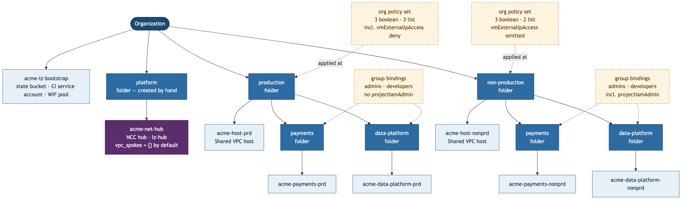
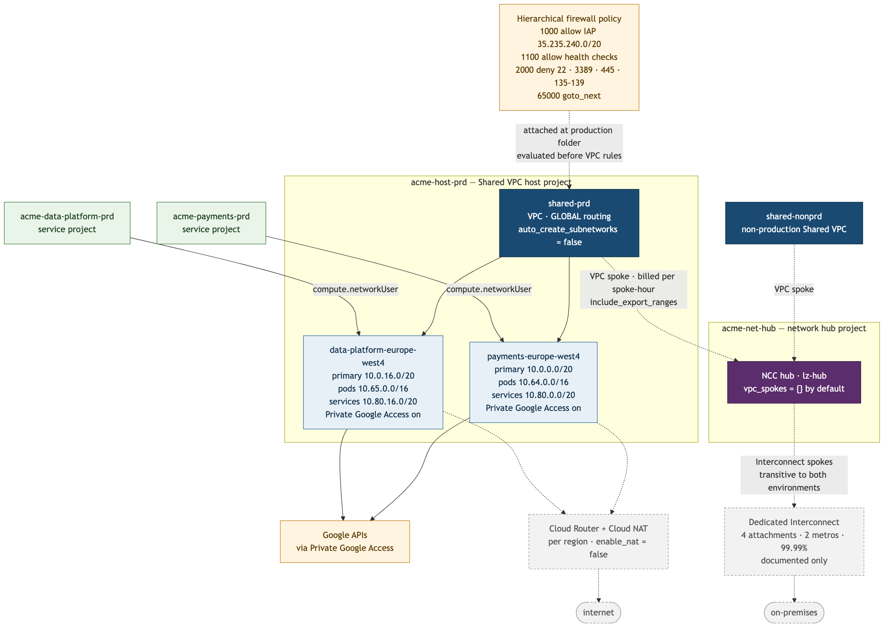

# gcp-landing-zone-terraform

A reference Google Cloud landing zone — org hierarchy, org policy, Shared VPC,
group-based IAM, a project factory, and keyless CI/CD — written to be read by a
reviewer, not just applied.

> **Status: written and validated, not yet applied.** Every module and root
> passes `terraform fmt -check` and `terraform validate`, and the wiring has
> been checked with `terraform console`. Nothing in this repository has been
> applied against a live organization. Where a claim depends on something only
> an apply can prove, it says so.

## What's in here

| Component | Purpose | Cost at rest |
|---|---|---|
| `environments/bootstrap` | State bucket, CI service account, Workload Identity pool | State bucket only, under $0.05/mo |
| `modules/folder-structure` | Environment and team folders | Free |
| `modules/org-policies` | Org policy v2 constraints, per environment | Free |
| `modules/shared-vpc` | Host project, network, subnets, hierarchical firewall policy | Free unless `enable_nat` / `enable_flow_logs` |
| `modules/project-factory` | One `teams.yaml` entry → project, IAM, subnet, budget, CI identity | Free |
| `modules/ncc-hub` + `environments/network-hub` | NCC transit hub joining both Shared VPCs and, later, Interconnect | **Billed per spoke-hour once `vpc_spokes` is populated** |
| `.github/workflows` | Plan on PR, gated apply on merge, keyless auth | Free |
| `environments/sandbox` | Scratch root for trying org policy safely | Free |

The NCC hub is the only component with a permanent cost, and it is off by
default — see [Cost](#cost) and
[ADR 002](docs/decisions/002-ncc-hub-topology.md).

## The problem

A new GCP organization gives you a flat namespace, no guardrails, and a
`default` VPC in every project with firewall rules nobody chose. The usual
result is a few dozen projects with inconsistent IAM, no cost attribution, and
service account keys in CI.

This repository is the opposite starting point: a hierarchy that makes org
policy inherit correctly, one network owned centrally with subnets delegated
per team, and a factory that turns a single YAML entry into everything a team
needs. The constraint throughout is that a reviewer who will not read the
Terraform should still be able to tell what was decided and what it cost.

## Architecture

### Hierarchy



Environment sits above team, so `production` and `non-production` are folders
and each team gets a folder inside both. That ordering exists because org
policy only flows downward and the constraints that matter differ by
environment rather than by team — production denies external IPs, restricts
resource locations and blocks service account keys; non-production loosens the
first of those deliberately. Putting environment on top means each policy set
is expressed once, at one node, and every team created afterwards inherits it
by construction. The cost is that per-team IAM delegation gets worse, which
[ADR 001](docs/decisions/001-folder-hierarchy.md) argues is the right trade.

The `bootstrap` project sits directly under the org and holds the Terraform
state bucket, the CI service account, and the Workload Identity pool. It has no
other purpose, so any change to its IAM policy is by definition a change to who
can reach state — see [ADR 000](docs/decisions/000-bootstrap-and-state.md).

### Network



Each environment has its own Shared VPC host project and network. Team projects
attach as service projects and are granted `compute.networkUser` **on their own
subnet**, not on the host project, so a team can use its range and cannot see
or attach to anyone else's. GKE pods and services secondary ranges are
allocated with the subnet rather than when a cluster first appears, because
secondary ranges cannot be added to a subnet carrying traffic without
disruption.

Address ranges are written explicitly in `teams/teams.yaml` rather than
generated with `cidrsubnet()`. The generated version is shorter and renumbers
every subnet after an inserted team, which Terraform reads as
destroy-and-recreate — an alphabetical insert becomes a network outage.

A hierarchical firewall policy attaches at the environment folder and is
evaluated before any project's VPC rules, so a deny there is final. It denies
the management ports that get a VM compromised and delegates everything else
downward, rather than denying by default and requiring a complete allow list
before anything can serve traffic.

### Transit

Above the two Shared VPCs sits a Network Connectivity Center hub in its own
project, with each environment's network attached as a VPC spoke. This is what
makes one set of Interconnect attachments reachable from both environments —
VPC peering is non-transitive, so an attachment landing in production would
serve production only and hybrid connectivity would have to be built twice.

Team growth does not touch this layer: a new team gets a subnet inside an
existing spoke's VPC, not a spoke of its own. That is deliberate, and it is why
Shared VPC was kept underneath rather than replaced with a VPC per team — the
recurring cost scales with environment count, not team count. See
[ADR 002](docs/decisions/002-ncc-hub-topology.md).

Hybrid connectivity itself is designed but not built. The Interconnect
topology, routing and trade-offs are in
[docs/architecture.md](docs/architecture.md).

### Project factory

One entry in [`teams/teams.yaml`](teams/teams.yaml) produces, per environment:
a folder, a project, group role bindings at that folder, Shared VPC attachment,
subnet IAM, a budget with alert thresholds, and a CI service account federated
to that team's repository alone. Adding a team is a change to that one file.

## Key decisions

| Decision | Chosen | Alternative | Why |
|---|---|---|---|
| [State and bootstrap](docs/decisions/000-bootstrap-and-state.md) | Dedicated bootstrap project, GCS backend | State in an existing project; HCP Terraform | The state bucket's IAM policy has no other reason to change, so any change to it is legible as a change to state access |
| [Folder hierarchy](docs/decisions/001-folder-hierarchy.md) | Environment above team | Team above environment; flat | A missed org policy on a production folder is an incident; a duplicated IAM binding is an annoyance automation absorbs |
| [Transit topology](docs/decisions/002-ncc-hub-topology.md) | NCC hub above Shared VPC | VPC peering; per-team VPC spokes; stay disconnected | Peering is non-transitive, so one Interconnect could not serve both environments. Cost scales with environments, not teams |
| IAM roles | Predefined role sets | `roles/editor` at the folder | A basic role covers services released after it was granted, so nobody can state its scope at review |
| CI authentication | Workload Identity Federation | Service account keys | A leaked key has no expiry and no device binding; org policy blocks key creation outright |

## Cost

**As written, this landing zone costs almost nothing to run.** Folders,
projects, org policy, IAM bindings, service accounts, Shared VPC attachment,
firewall policy rules and budgets are all free. The only billed resource at
rest is the Terraform state bucket — a few megabytes of standard storage, under
$0.05/month.

That is a deliberate property, not an accident. Two switches change it:

| Lever | Default | What it bills on |
|---|---|---|
| `vpc_spokes` | `{}` | Per spoke-hour, regardless of traffic. Two environments = two spokes, **permanently** |
| `enable_nat` | `false` | Per-VM hour using the gateway (capped at 32 VMs), per-GiB processed, per external IP hour, plus egress — **per region** |
| `enable_flow_logs` | `false` | Per GB of logs generated, scaling with traffic rather than instance count |

The NCC spokes are different in kind from the other two. NAT and flow logs are
things you switch on while you need them. A transit fabric that is switched off
is not a transit fabric — once the hub carries traffic, that cost is permanent.
It scales with environment count rather than team count, which is the reason
Shared VPC was kept underneath NCC rather than replaced by a VPC per team; see
[ADR 002](docs/decisions/002-ncc-hub-topology.md).

**The dominant line item in any real deployment is Cloud NAT**, followed by
NCC spoke-hours, then flow logs, then Interconnect if hybrid connectivity is
built — the
99.99% topology multiplies the port charge by four before a byte moves, and
colocation cross-connect fees never appear on the GCP bill at all.

**Verify current rates before quoting any of this:**
[Cloud NAT pricing](https://cloud.google.com/nat/pricing) ·
[Network Connectivity pricing](https://cloud.google.com/network-connectivity/pricing) ·
[Interconnect pricing](https://cloud.google.com/network-connectivity/docs/interconnect/pricing).
Figures here are deliberately given as billing axes rather than dollar amounts,
because a stale number in a cost table is worse than no number.

Levers for reducing it: leave `enable_nat` off and reach Google APIs through
Private Google Access, which is free and is why every subnet has it enabled;
enable flow logs per subnet only while investigating something; and set
`budget_usd` per team per environment so overspend surfaces against a named
owner rather than as one org-wide total.

## Running this

### Prerequisites

- Terraform >= 1.13.4 (CI pins this exact version — state is forward-incompatible)
- `gcloud` authenticated as a user with Organization Administrator
- A GCP organization and a billing account
- Google Groups created for `terraform_admin_group` and each team's
  `admins` / `developers` — this repo binds IAM to groups only, never to users
- A **platform folder created by hand**, if you intend to apply
  `environments/network-hub`. Nothing in this repo creates it: the environment
  folders belong to environments, and the transit hub belongs to neither.

  ```bash
  gcloud resource-manager folders create --display-name=platform --organization=ORG_ID
  ```
- **An org-level budget with alerts set before your first apply**

### 1. Bootstrap (applied by a human, once)

```bash
cd environments/bootstrap
cp terraform.tfvars.example terraform.tfvars   # fill in your values
terraform init
terraform plan                                  # read every line
terraform apply
```

Then move this root onto the bucket it just created: copy the `state_bucket`
output into the `backend "gcs"` block in `versions.tf`, uncomment it, and run
`terraform init -migrate-state`.

This is the only root applied with human credentials, because it creates the
identity CI runs as.

### 2. Environments

```bash
cd environments/production        # then repeat for non-production
cp terraform.tfvars.example terraform.tfvars
terraform init
terraform plan
terraform apply
```

### 3. Transit hub (optional, and the only recurring cost)

```bash
cd environments/network-hub
cp terraform.tfvars.example terraform.tfvars
terraform init
terraform apply                 # creates the hub; nothing bills yet
```

Applies third, because its spokes reference networks the environment roots
create. To attach them, copy the two `network_self_link` outputs into
`vpc_spokes` and apply again — that second apply is where billing starts.

```bash
terraform -chdir=../production     output -raw network_self_link
terraform -chdir=../non-production output -raw network_self_link
```

### 4. CI

```bash
gh variable set WIF_PROVIDER \
  --body "$(terraform -chdir=environments/bootstrap output -raw workload_identity_provider)"
gh variable set CI_SERVICE_ACCOUNT \
  --body "$(terraform -chdir=environments/bootstrap output -raw ci_service_account_email)"

gh api -X PUT repos/:owner/:repo/environments/production
gh api -X PUT repos/:owner/:repo/environments/non-production
```

Then add required reviewers to both environments in Settings → Environments.
Until you do, `environment:` in the apply workflow gates nothing.

### Adding a team

Add an entry to `teams/teams.yaml` with non-overlapping CIDRs, open a PR, and
read the plan comment. That is the whole change.

## What this does not cover

- **Nothing here has been applied to a live org.** Validated and reviewed, not
  proven.
- **No Interconnect or VPN.** Designed and costed in `docs/architecture.md`,
  not provisioned — it has standing cost and a physical dependency.
- **Overlapping CIDRs are not detected.** Ranges in `teams.yaml` are reviewed
  by a human reading the diff; nothing catches an overlap before `apply` does.
- **Budgets alert, they do not act.** With no notification channel configured
  they email billing administrators, who are generally not the people who can
  reduce a team's spend.
- **Plan and apply are separate plans.** The apply workflow re-plans after
  merge, so what lands is not provably what was reviewed.
- **`terraform plan` on a PR uses the same org-privileged identity as apply.**
  Fork PRs are skipped; a collaborator's branch is not.
- **The hub's routing behaviour is unproven.** Export-range interactions
  between spokes read correctly and are exactly the kind of thing that behaves
  differently in practice.
- **No dependency enforcement across roots.** The hub applies after both
  environments; nothing but an error message stops someone applying them out of
  order.
- **No Interconnect or VPN spokes attached to the hub.** The hub exists to make
  them possible; they are designed in `docs/architecture.md`, not built.
- **No policy-as-code, no drift detection, no VPC Service Controls, no log
  sinks, no organization-wide Cloud DNS.**
